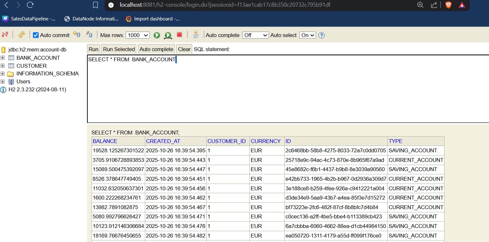
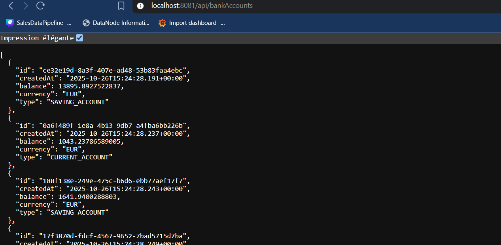
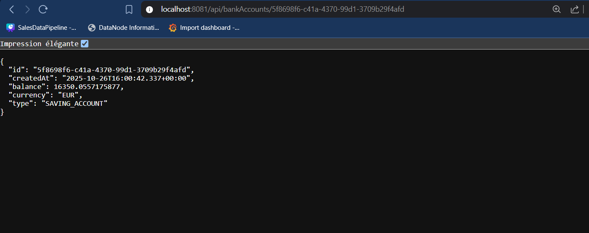
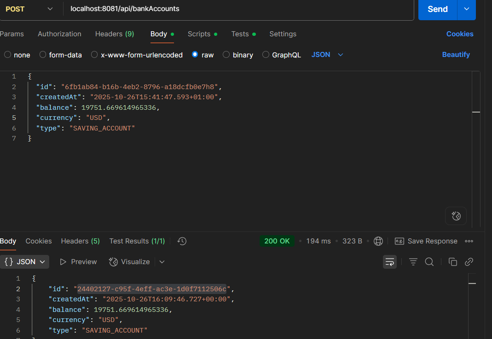
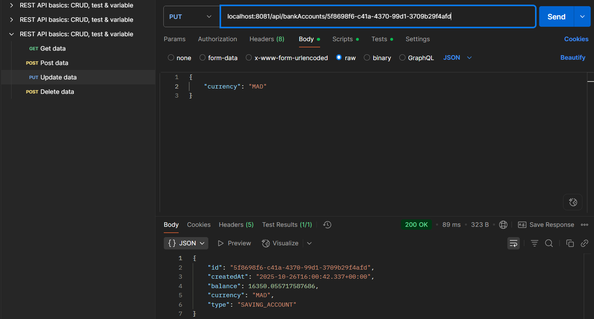
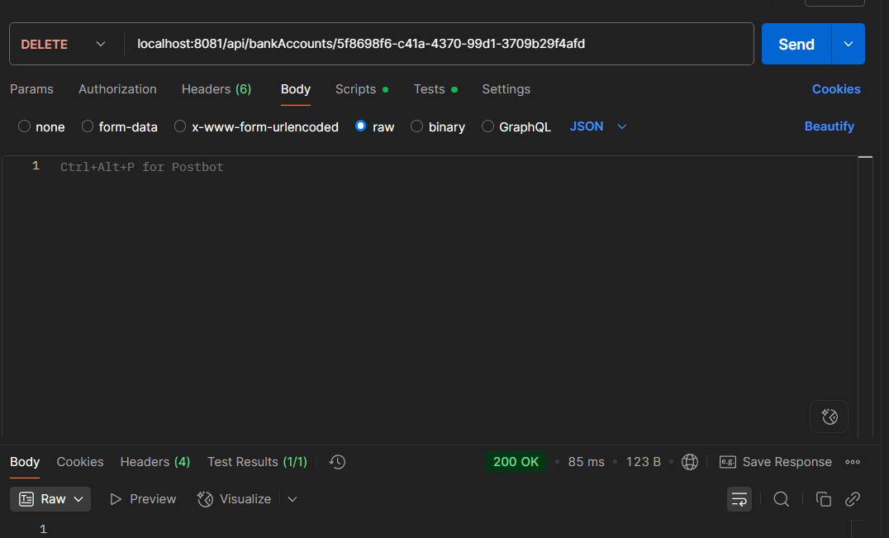
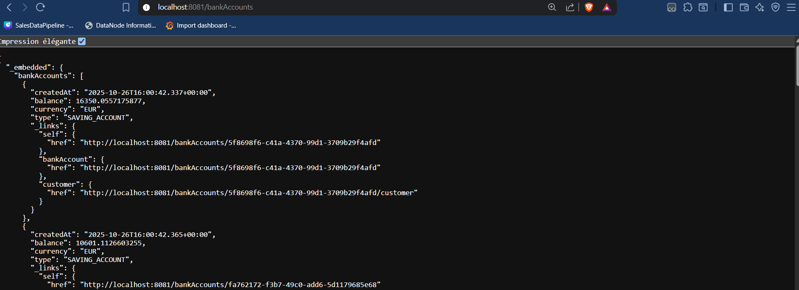
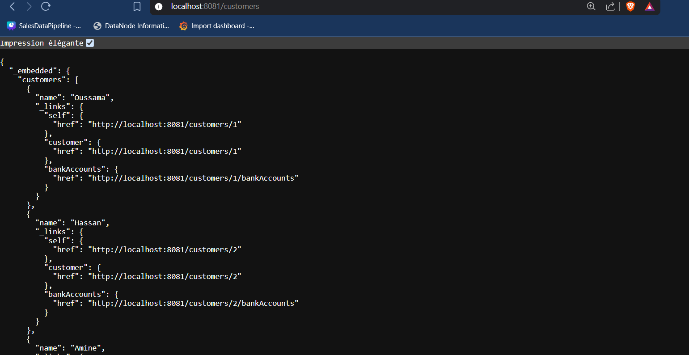
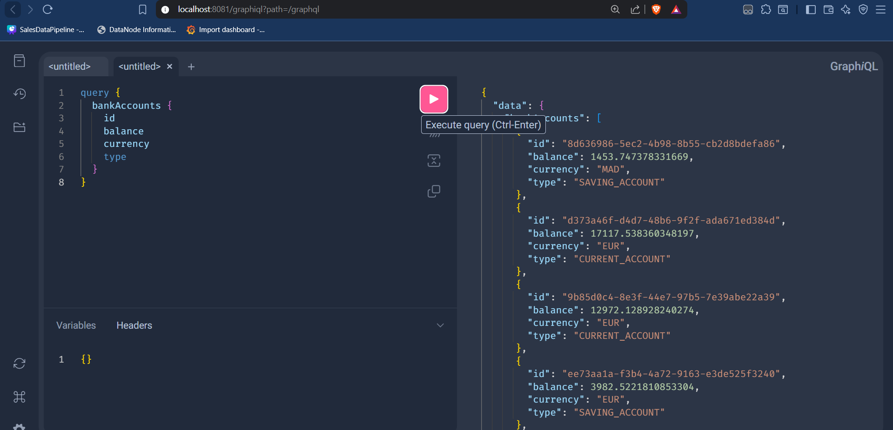

# Bank Account Microservice

This project is a Spring Boot microservice for managing bank accounts and their customers.
It exposes RESTful services and GraphQL endpoints to interact with data.
The H2 in-memory database facilitates rapid development and testing.

## H2 Console

**URL**: http://localhost:8081/h2-console



## REST API

### GET All Accounts

```
http://localhost:8081/api/bankAccounts
```



### GET Account by ID

```
http://localhost:8081/api/bankAccounts/{id}
```



### POST Create Account

```
POST http://localhost:8081/api/bankAccounts
```



### PUT Update Account

```
PUT http://localhost:8081/api/bankAccounts/{id}
```



### DELETE Account

```
DELETE http://localhost:8081/api/bankAccounts/{id}
```



## Spring Data REST

### GET All Accounts (HAL Format)

```
http://localhost:8081/bankAccounts
```



### GET All Customers

```
http://localhost:8081/customers
```



## GraphQL

**URL**: http://localhost:8081/graphiql


